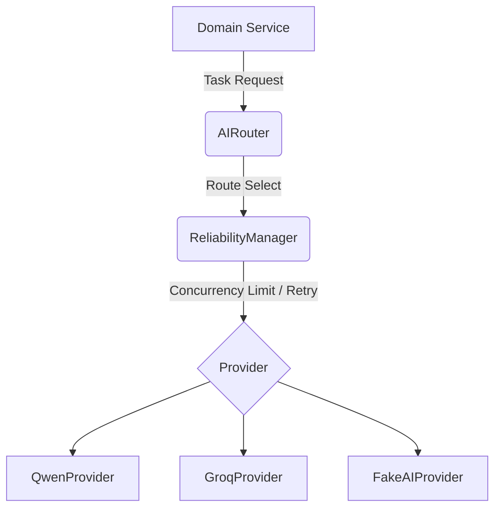

# AI Provider Architecture

## Core Concepts
The AI Infrastructure revolves around four main layers:
1. **Application Domain Layer:** (e.g., `ResumeService`, `InterviewController`) requests task-specific actions.
2. **AI Router:** Selects the appropriate Model and Provider based on the `AITask`.
3. **Reliability Manager:** Handles timeouts, bounded concurrency, exponential backoff, and fallbacks.
4. **Provider Interfaces:** Abstractions conforming to `AIProvider` that handle direct LLM HTTP calls.

## Component Overview

- **`AIContextBuilder`:** Separates `VERIFIED` facts from `AI_SUGGESTED` facts when constructing prompts for models.
- **`PromptRegistry`:** Versioned static mapping for prompts.
- **`AIRouter`:** Maps tasks (e.g., `JOB_MATCHING`) to primary (`qwen-27b`) and fallback (`gpt-oss-120b`) models.
- **`FakeAIProvider`:** Used exclusively for `NODE_ENV=test` to ensure CI tests run deterministically without incurring network latency or timeouts.

## Flow

