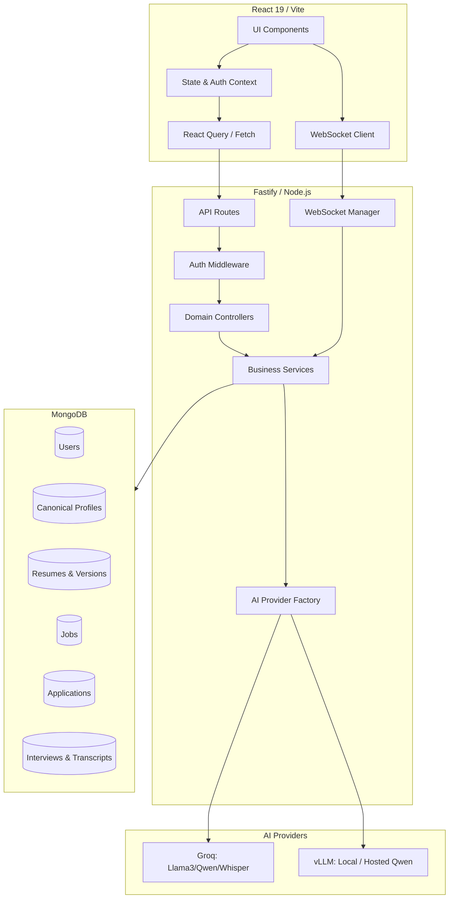

# Interview AI Target Architecture

## High-Level Architecture Map

## Architectural Principles
1. **Source of Truth**: MongoDB is the absolute source of truth. AI inferences must never silently overwrite user data without explicit status markers (`AI_SUGGESTED`, `VERIFIED`).
2. **Provider Agnosticism**: The `AILayer` must wrap all LLM interactions so that swapping Groq for OpenAI or vLLM requires changing only one file.
3. **Stateless APIs**: REST endpoints are completely stateless, authenticating via JWT on every request.
4. **Stateful Interviews**: Interview sessions use persistent WebSockets to maintain conversational state and stream STT/TTS with low latency.
