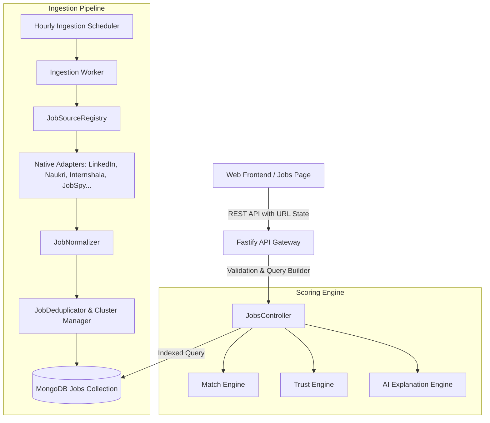

# Jobs Discovery System Architecture

## Overview
Interview AI provides a unified, production-grade Jobs Discovery system tailored for Indian tech talent. It aggregates, normalizes, deduplicates, verifies, and scores opportunities across multiple primary and specialized job boards.

## Core Architectural Principles
1. **Single Authoritative Jobs Discovery Surface**: There is only one Jobs page (`apps/web/src/pages/JobsPage.tsx`) and one authoritative backend module (`apps/api-node/src/modules/jobs/`).
2. **Canonical Provenance & Isolation**: Every job document maintains an immutable `source` enum representing where the job was actually produced. Unselected sources are never silently injected or substituted.
3. **Database-Driven Filtering Before Pagination**: All query conditions (platform, remote work mode, city, skills, seniority, experience range, salary, and search keywords) are executed in MongoDB prior to pagination and counting.
4. **Deterministic Pagination**: Sort orders employ compound stable keys (`sourcePostedAt: -1, createdAt: -1, _id: -1`), guaranteeing that no job ever appears on multiple consecutive pages.
5. **Separation of Concerns**:
   - Match Score (deterministic alignment with candidate profile skills, experience, and role).
   - Trust Score (independent signal based on domain verification, spam heuristics, salary sanity, and freshness).
   - Recommendation Priority (ranking signal combining Match, Trust, and freshness).
6. **High Concurrency & Load Resilience**: Designed and benchmarked for 1,000+ concurrent users with connection pooling, compound indexing, bounded payloads, safe regex escaping, and idempotent write operations.

## Architecture Diagram

